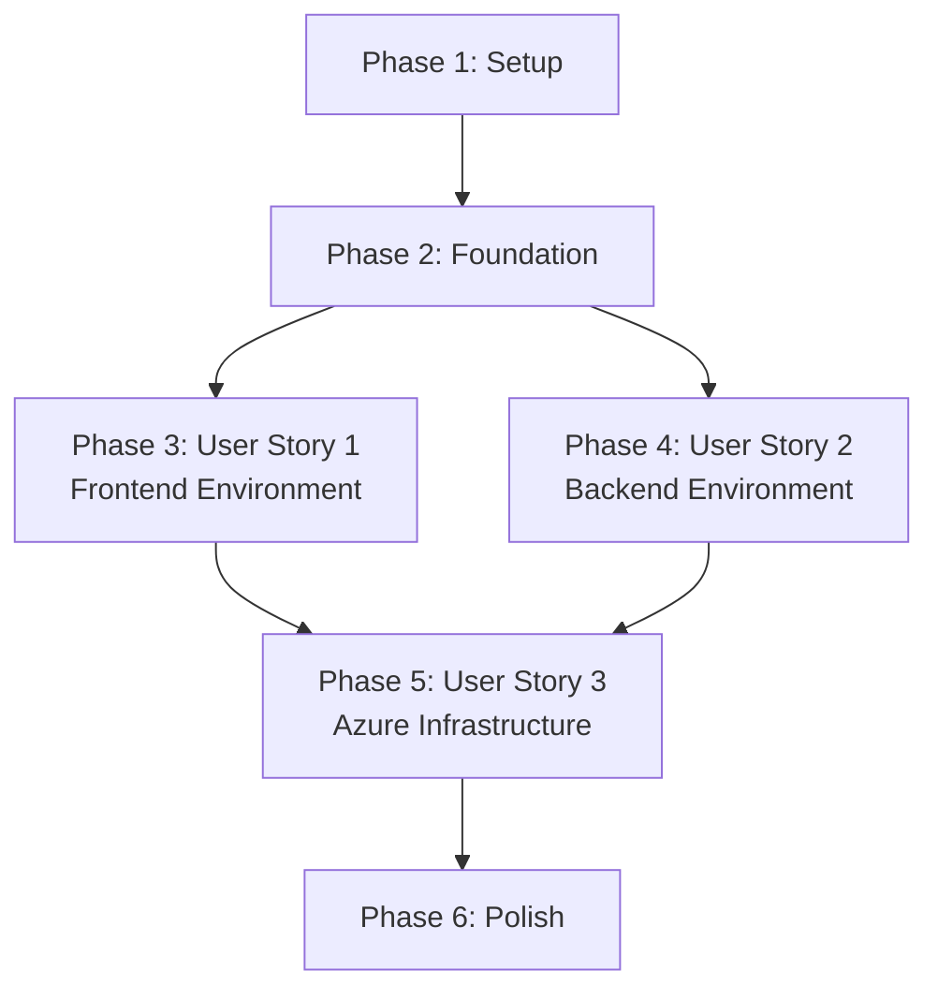

# Tasks: Infrastructure Setup

**Feature**: 001-infrastructure-setup  
**Input**: Design documents from `/specs/001-infrastructure-setup/`  
**Prerequisites**: ✅ plan.md, ✅ spec.md, ✅ research.md, ✅ data-model.md, ✅ contracts/, ✅ quickstart.md

**Tests**: Not applicable - infrastructure setup tasks are validated via smoke tests and manual verification

**Organization**: Tasks are grouped by user story to enable independent implementation and testing of each environment.

---

## Format: `- [ ] [ID] [P?] [Story?] Description`

- **[P]**: Can run in parallel (different files, no dependencies)
- **[Story]**: Which user story this task belongs to (US1, US2, US3)
- Include exact file paths in descriptions

---

## Phase 1: Setup (Project Initialization)

**Purpose**: Initialize repository structure and documentation

- [x] T001 Create root-level directory structure: `frontend/`, `backend/`, `infrastructure/`, `.github/workflows/`
- [x] T002 [P] Create `.gitignore` with patterns for Node.js (`node_modules/`, `.env.local`), .NET (`bin/`, `obj/`, `*.user`), and IDE files
- [x] T003 [P] Copy quickstart instructions from `specs/001-infrastructure-setup/quickstart.md` to root `README.md`

**Checkpoint**: Repository structure ready for environment-specific implementation

---

## Phase 2: Foundational (Blocking Prerequisites)

**Purpose**: Shared configurations that all user stories depend on

- [x] T004 [P] Create `.nvmrc` with `20.0.0` to lock Node.js version for frontend
- [x] T005 [P] Create `backend/Stitches.sln` solution file referencing all C# projects (Api, Application, Domain, Infrastructure)
- [x] T006 [P] Create `infrastructure/README.md` with Azure provisioning instructions and runbook links

**Checkpoint**: Foundation ready - user story implementation can begin in parallel

---

## Phase 3: User Story 1 - Frontend Development Environment Setup (Priority: P1) 🎯 MVP

**Goal**: Developers can run React + Vite frontend locally on `localhost:5173` with HMR, testing, and linting

**Independent Test**: Clone repository, run `cd frontend && npm install && npm run dev`, verify React welcome page loads at `http://localhost:5173` with no console errors, make a change to `src/App.tsx` and verify HMR updates in < 1 second

### Project Initialization

- [x] T007 [US1] Initialize frontend project: `cd frontend && npm create vite@latest . -- --template react-ts` (React + TypeScript + Vite template)
- [x] T008 [US1] Install core dependencies in `frontend/package.json`: `react-router-dom` (state management via Context API deferred to feature requiring it)
- [x] T009 [US1] Install dev dependencies: `vitest`, `@testing-library/react`, `@testing-library/jest-dom`, `jsdom`, `eslint`, `prettier`, `@vitejs/plugin-react`

### Configuration Files

- [x] T010 [P] [US1] Create `frontend/vite.config.ts` with React plugin, dev server on port 5173, proxy `/api` to `http://localhost:5000`
- [x] T011 [P] [US1] Create `frontend/tsconfig.json` with strict mode enabled, paths configured for `@/` alias to `src/`
- [x] T012 [P] [US1] Create `frontend/vitest.config.ts` with jsdom environment, globals enabled, setupFiles pointing to `tests/setup.ts`
- [x] T013 [P] [US1] Create `frontend/.eslintrc.js` extending recommended React, hooks, TypeScript rules, and Prettier
- [x] T014 [P] [US1] Create `frontend/.prettierrc` with standard formatting rules (semi: true, singleQuote: true, tabWidth: 2)

### Project Structure

- [x] T015 [P] [US1] Create directory structure: `src/components/`, `src/pages/`, `src/services/`, `src/assets/`, `src/styles/`
- [x] T016 [P] [US1] Create `tests/unit/` and `tests/integration/` directories
- [x] T017 [P] [US1] Create `tests/setup.ts` with Testing Library global configuration and cleanup

### Environment Configuration

- [x] T018 [P] [US1] Create `frontend/.env.example` with `VITE_API_URL=http://localhost:5000`
- [x] T019 [US1] Create `frontend/.env.local` (gitignored) with same variables for local development
- [x] T020 [US1] Update `frontend/.gitignore` to include `.env.local`, `dist/`, `coverage/`

### Testing Setup

- [x] T021 [P] [US1] Create example component test in `tests/unit/App.test.tsx` verifying App renders without crashing
- [x] T022 [US1] Add test script to `package.json`: `"test": "vitest"`, `"test:ui": "vitest --ui"`

### Linting & Formatting

- [x] T023 [US1] Add lint scripts to `package.json`: `"lint": "eslint src --ext ts,tsx"`, `"format": "prettier --write src/**/*.{ts,tsx}"`
- [x] T024 [US1] Install Husky and lint-staged for pre-commit hooks: `npx husky-init && npm install --save-dev lint-staged`
- [x] T025 [US1] Configure `.husky/pre-commit` to run `npx lint-staged` with ESLint on staged files

### Documentation

- [x] T026 [US1] Create `frontend/README.md` with setup steps, prerequisites (Node 20+), and commands (dev, build, test, lint)

### Verification

- [x] T027 [US1] Run `npm install` and verify no errors
- [x] T028 [US1] Run `npm run dev` and verify server starts on `http://localhost:5173`
- [x] T029 [US1] Run `npm test` and verify example test passes
- [x] T030 [US1] Run `npm run lint` and verify no ESLint errors
- [x] T031 [US1] Test HMR: Modify `src/App.tsx`, save, verify browser updates in < 1 second

**Checkpoint**: Frontend environment complete and independently functional

---

## Phase 4: User Story 2 - Backend API Development Environment Setup (Priority: P1)

**Goal**: Developers can run ASP.NET Core API locally on `localhost:5000` with Swagger docs, database migrations, and testing

**Independent Test**: Clone repository, run `cd backend && dotnet restore && dotnet run --project src/Api`, verify Swagger UI at `http://localhost:5000/swagger` shows health endpoint, call `/api/health` and receive `200 OK`

### Project Initialization

- [x] T032 [US2] Create solution: `cd backend && dotnet new sln -n Stitches`
- [x] T033 [US2] Create Api project: `dotnet new webapi -n Api -o src/Api --framework net10.0`
- [x] T034 [US2] Create Application project: `dotnet new classlib -n Application -o src/Application --framework net10.0`
- [x] T035 [US2] Create Domain project: `dotnet new classlib -n Domain -o src/Domain --framework net10.0`
- [x] T036 [US2] Create Infrastructure project: `dotnet new classlib -n Infrastructure -o src/Infrastructure --framework net10.0`
- [x] T037 [US2] Add projects to solution: `dotnet sln add src/Api src/Application src/Domain src/Infrastructure`

### Test Projects

- [x] T038 [P] [US2] Create Api.Tests: `dotnet new xunit -n Api.Tests -o tests/Api.Tests --framework net10.0`
- [x] T039 [P] [US2] Create Application.Tests: `dotnet new xunit -n Application.Tests -o tests/Application.Tests --framework net10.0`
- [x] T040 [P] [US2] Create Domain.Tests: `dotnet new xunit -n Domain.Tests -o tests/Domain.Tests --framework net10.0`
- [x] T041 [P] [US2] Create Integration.Tests: `dotnet new xunit -n Integration.Tests -o tests/Integration.Tests --framework net10.0`
- [x] T042 [US2] Add test projects to solution: `dotnet sln add tests/Api.Tests tests/Application.Tests tests/Domain.Tests tests/Integration.Tests`

### Dependencies

- [x] T043 [US2] Add project references: Api → Application, Infrastructure; Application → Domain; Infrastructure → Domain
- [x] T044 [US2] Install NuGet packages in Api: `Swashbuckle.AspNetCore`, `Microsoft.ApplicationInsights.AspNetCore`, `Azure.Identity`, `Azure.Security.KeyVault.Secrets`
- [x] T045 [US2] Install NuGet packages in Infrastructure: `Microsoft.EntityFrameworkCore.SqlServer`, `Microsoft.EntityFrameworkCore.Tools`, `Microsoft.EntityFrameworkCore.Design`
- [x] T046 [US2] Install NuGet packages in test projects: `NSubstitute`, `FluentAssertions`, `Microsoft.AspNetCore.Mvc.Testing` (for Integration.Tests)

### Configuration Files

- [x] T047 [P] [US2] Create `backend/.editorconfig` with C# style rules (naming conventions, indentation, code analysis)
- [x] T048 [P] [US2] Create `backend/appsettings.json` with shared defaults (no connection strings or secrets)
- [x] T049 [P] [US2] Create `backend/appsettings.Development.json` with LocalDB connection string: `Server=(localdb)\\mssqllocaldb;Database=Stitches;Trusted_Connection=True`
- [x] T050 [US2] Update `backend/.gitignore` to include `appsettings.*.user.json`, `bin/`, `obj/`, `*.user`

### Health Check Implementation

- [x] T051 [US2] Create `src/Api/Controllers/HealthController.cs` with GET endpoint returning `{ status: "healthy", timestamp: DateTime.UtcNow }`
- [x] T052 [US2] Configure `src/Api/Program.cs` with health checks middleware: `builder.Services.AddHealthChecks()`, `app.MapHealthChecks("/api/health")`

### Swagger Configuration

- [x] T053 [US2] Configure Swagger in `src/Api/Program.cs`: `builder.Services.AddSwaggerGen()`, enable only in Development environment
- [x] T054 [US2] Add XML documentation comments to HealthController for Swagger UI display

### Database Setup

- [x] T055 [US2] Create `src/Infrastructure/Data/ApplicationDbContext.cs` inheriting from `DbContext`
- [x] T056 [US2] Register DbContext in `src/Api/Program.cs`: `builder.Services.AddDbContext<ApplicationDbContext>()` with connection string from configuration
- [x] T057 [US2] Initialize EF Core migrations: `cd src/Infrastructure && dotnet ef migrations add InitialCreate --startup-project ../Api`
- [x] T058 [US2] Configure migration assembly in `ApplicationDbContext`: `optionsBuilder.UseSqlServer(x => x.MigrationsAssembly("Infrastructure"))`

### User Secrets

- [x] T059 [US2] Initialize user secrets: `cd src/Api && dotnet user-secrets init`
- [x] T060 [US2] Set local connection string: `dotnet user-secrets set "ConnectionStrings:DefaultConnection" "Server=(localdb)\\mssqllocaldb;Database=Stitches;Trusted_Connection=True"`

### Testing Setup

- [x] T061 [P] [US2] Create example test in `tests/Api.Tests/HealthControllerTests.cs` verifying health endpoint returns 200 OK
- [x] T062 [US2] Verify tests run: `dotnet test` from backend directory

### Documentation

- [x] T063 [US2] Create `backend/README.md` with setup steps, prerequisites (.NET 10 SDK), commands (run, test, migrate), and User Secrets instructions

### Verification

- [x] T064 [US2] Run `dotnet restore` and verify no errors
- [x] T065 [US2] Run `dotnet ef database update --project src/Infrastructure --startup-project src/Api` and verify database created
- [x] T066 [US2] Run `dotnet run --project src/Api` and verify API starts on `http://localhost:5000`
- [x] T067 [US2] Open `http://localhost:5000/swagger` and verify Swagger UI displays with health endpoint
- [x] T068 [US2] Call `/api/health` via Swagger or browser and verify `200 OK` response with JSON body
- [x] T069 [US2] Run `dotnet test` and verify all tests pass

**Checkpoint**: Backend environment complete and independently functional

---

## Phase 5: User Story 3 - Azure Cloud Infrastructure Provisioning (Priority: P2)

**Goal**: Azure resources provisioned via IaC with CI/CD pipeline deploying to staging on push to main

**Independent Test**: Run `az deployment group create --resource-group stitches-staging --template-file infrastructure/bicep/main.bicep`, verify all resources created in Azure portal, trigger CI/CD pipeline via push to main, verify application deploys to staging with health check passing

### Bicep Module Structure

- [x] T070 [US3] Create `infrastructure/bicep/main.bicep` with parameters for environment (dev/staging/prod) and resource group
- [x] T071 [P] [US3] Create `infrastructure/bicep/modules/app-service-plan.bicep` with SKU parameter and capacity logic (1 for staging, 2 for prod)
- [x] T072 [P] [US3] Create `infrastructure/bicep/modules/app-service.bicep` with managed identity, HTTPS-only (enforced for cloud, local dev uses HTTP), and Key Vault reference
- [x] T073 [P] [US3] Create `infrastructure/bicep/modules/sql-database.bicep` with zone-redundant backup for prod
- [x] T074 [P] [US3] Create `infrastructure/bicep/modules/blob-storage.bicep` with RA-GRS replication for prod
- [x] T075 [P] [US3] Create `infrastructure/bicep/modules/key-vault.bicep` with access policies for App Service managed identity
- [x] T076 [P] [US3] Create `infrastructure/bicep/modules/app-insights.bicep` with connection string output
- [x] T077 [P] [US3] Create `infrastructure/bicep/modules/cdn.bicep` with App Service origin

### Parameter Files

- [x] T078 [P] [US3] Create `infrastructure/bicep/parameters/dev.parameters.json` with B1 SKU, 1 instance, LRS storage
- [x] T079 [P] [US3] Create `infrastructure/bicep/parameters/staging.parameters.json` with S1 SKU, 1 instance, LRS storage
- [x] T080 [P] [US3] Create `infrastructure/bicep/parameters/prod.parameters.json` with P1v2 SKU, 2 instances, RA-GRS storage, zone-redundant DB

### Main Template Integration

- [x] T081 [US3] Wire modules in `main.bicep`: call all module files with parameter passing and output collection
- [x] T082 [US3] Add outputs in `main.bicep` for App Service URL, Key Vault URL, Application Insights connection string

### Deployment Scripts

- [x] T083 [US3] Create `infrastructure/scripts/provision.sh` that runs `az deployment group create` with parameter file selection
- [x] T084 [P] [US3] Create `infrastructure/scripts/smoke-test.sh` that curls `/api/health` endpoint and validates 200 OK response
- [x] T085 [P] [US3] Create `infrastructure/scripts/migrate.sh` that runs EF Core migrations against Azure SQL Database

### Key Vault Secrets

- [x] T086 [US3] Update `infrastructure/scripts/provision.sh` to create secrets in Key Vault after provisioning: DatabaseConnectionString, JwtSigningKey placeholders
- [x] T086b [US3] Create placeholder OAuth client secret in Key Vault: `OAuthClientSecret` with temporary value (to be updated in Feature 1 when OAuth providers are integrated)

### GitHub Actions - Staging Pipeline

- [x] T087 [US3] Create `.github/workflows/deploy-staging.yml` with trigger on push to main branch
- [x] T088 [US3] Add job: `test-frontend` - installs Node.js 20, runs `npm ci && npm test` in frontend/
- [x] T089 [US3] Add job: `test-backend` - installs .NET 10, runs `dotnet test` in backend/
- [x] T090 [US3] Add job: `build-frontend` (needs: test-frontend) - runs `npm run build`, uploads artifact `frontend-dist`
- [x] T091 [US3] Add job: `build-backend` (needs: test-backend) - runs `dotnet publish -c Release`, uploads artifact `backend-publish`
- [x] T092 [US3] Add job: `provision-infra` (needs: [build-frontend, build-backend]) - runs Bicep deployment with staging parameters
- [x] T093 [US3] Add job: `migrate-database` (needs: provision-infra) - runs EF Core migrations against staging database
- [x] T094 [US3] Add job: `deploy-app` (needs: migrate-database) - downloads artifacts, deploys to App Service using `azure/webapps-deploy@v2`
- [x] T095 [US3] Add job: `smoke-test` (needs: deploy-app) - runs `smoke-test.sh` against staging URL, fails pipeline if health check fails

### GitHub Actions - Production Pipeline

- [x] T096 [US3] Create `.github/workflows/deploy-production.yml` with trigger on `workflow_dispatch` (manual only)
- [x] T097 [US3] Copy staging pipeline structure but with prod parameters and manual approval environment

### GitHub Actions - PR Validation

- [x] T098 [P] [US3] Create `.github/workflows/pr-validation.yml` with trigger on pull_request, runs tests only (no deployment)

### Secret Masking

- [x] T099 [US3] Add `::add-mask::` commands in workflow for any secrets loaded from Azure or GitHub secrets

### Application Insights Alerts

- [x] T100 [US3] Create alert rule in Bicep for API latency > 500ms (p95) over 5 minutes
- [x] T101 [US3] Create alert rule in Bicep for availability < 99.5% over 30 days
- [x] T102 [US3] Create alert rule in Bicep for error rate > 1% over 5 minutes
- [x] T103 [US3] Configure action group in Bicep for email/webhook notifications

### Cost Management

- [x] T104 [US3] Create Azure Cost Management budget alert at $500/month threshold via Azure CLI or portal (not Bicep-supported)
  - **Note**: This is a manual step - Azure Cost Management budgets cannot be created via Bicep IaC
  - Document in `infrastructure/README.md` and `docs/runbooks/deployment-failure.md`
  - Azure CLI command: `az consumption budget create --resource-group stitches-[env] --budget-name monthly-budget --amount 500 --time-grain Monthly`

### Backend Application Insights Integration

- [X] T105 [US3] Update `backend/src/Api/Program.cs` to add Application Insights: `builder.Services.AddApplicationInsightsTelemetry()`
- [X] T106 [US3] Configure connection string from Key Vault in `Program.cs` using `DefaultAzureCredential()`

### Backend Key Vault Integration

- [X] T107 [US3] Update `backend/src/Api/Program.cs` to load secrets from Key Vault at startup using Managed Identity
- [X] T108 [US3] Replace hardcoded connection strings with Key Vault references: `builder.Configuration["ConnectionStrings:Default"] = keyVaultSecret.Value`

### Runbooks

- [X] T109 [P] [US3] Create `docs/runbooks/deployment-failure.md` with troubleshooting steps for failed deployments
- [X] T110 [P] [US3] Create `docs/runbooks/migration-rollback.md` with steps to revert EF Core migrations
- [X] T111 [P] [US3] Create `docs/runbooks/key-vault-access.md` with steps to diagnose and fix Managed Identity issues

### Documentation

- [x] T112 [US3] Update `infrastructure/README.md` with Azure provisioning instructions, prerequisites (Azure CLI, subscription), manual deployment procedure, and Cost Management budget setup steps (see T104)

### Verification

- [x] T113 [US3] Run `infrastructure/scripts/provision.sh staging` and verify all resources created in Azure portal
- [x] T114 [US3] Manually deploy backend to App Service: `az webapp deploy` and verify health endpoint accessible
- [x] T115 [US3] Verify Application Insights receiving telemetry from deployed app
- [x] T116 [US3] Trigger CI/CD pipeline by pushing to main, verify all jobs complete successfully
- [x] T117 [US3] Verify smoke test passes in pipeline (health check returns 200 OK)
- [x] T118 [US3] Check GitHub Actions logs to ensure no secrets are exposed (masked correctly)
- [x] T119 [US3] Verify database migrations executed successfully during deployment

**Checkpoint**: Azure infrastructure complete, CI/CD pipeline functional, application deployed to staging

---

## Phase 6: Polish & Cross-Cutting Concerns

**Purpose**: Final improvements affecting multiple components

- [X] T120 [P] Update root `/README.md` with overview, architecture diagram, and links to frontend/backend READMEs
- [X] T121 [P] Add `CONTRIBUTING.md` with contribution guidelines, branch naming, commit message format
- [X] T122 [P] Add `CODE_OF_CONDUCT.md` for community guidelines
- [X] T123 Verify all acceptance criteria from spec.md are met for all three user stories
- [X] T124 Run complete quickstart validation: New developer clones repo and follows `specs/001-infrastructure-setup/quickstart.md` end-to-end
- [X] T125 Performance validation: Verify frontend HMR < 1s, backend health check < 50ms, CI/CD < 10 min
- [X] T126 Security audit: Run `npm audit` in frontend, `dotnet list package --vulnerable` in backend, fix any high/critical issues
- [X] T127 [P] Create GitHub issue templates in `.github/ISSUE_TEMPLATE/` for bug reports and feature requests

---

## Dependencies & Execution Order

### Phase Dependencies

- **Setup (Phase 1)**: No dependencies - start immediately
- **Foundational (Phase 2)**: Depends on Setup completion - BLOCKS all user stories
- **User Story 1 (Phase 3)**: Depends on Foundational completion - can proceed in parallel with US2
- **User Story 2 (Phase 4)**: Depends on Foundational completion - can proceed in parallel with US1
- **User Story 3 (Phase 5)**: Depends on US1 AND US2 completion (needs frontend build + backend API to deploy)
- **Polish (Phase 6)**: Depends on all user stories completion

### User Story Dependencies

- **User Story 1**: Can start after Foundational - independent
- **User Story 2**: Can start after Foundational - independent
- **User Story 3**: MUST wait for US1 AND US2 (needs artifacts to deploy)

### Within Each User Story

**User Story 1 (Frontend)**:
1. Project init (T007-T009) → Config files (T010-T014, all parallel) → Structure (T015-T017, all parallel)
2. Environment setup (T018-T020) can run parallel with config files
3. Testing, linting, docs (T021-T026) depend on structure being ready
4. Verification (T027-T031) runs last

**User Story 2 (Backend)**:
1. Project init (T032-T037) → Test projects (T038-T042, all parallel) → Dependencies (T043-T046)
2. Config files (T047-T050, all parallel) can start after project init
3. Implementation (T051-T058) depends on dependencies installed
4. Testing, docs, verification (T061-T069) run last

**User Story 3 (Infrastructure)**:
1. Bicep modules (T071-T077, all parallel) → Main template (T081-T082)
2. Parameter files (T078-T080, all parallel) can run parallel with modules
3. Scripts (T083-T085, all parallel) → Pipelines (T087-T098)
4. Application integration (T105-T108) → Verification (T113-T119)

### Parallel Opportunities

**Maximum parallelization with 3 developers after Foundational phase**:
- **Developer A**: Complete User Story 1 (T007-T031) - 25 tasks, ~2-3 days
- **Developer B**: Complete User Story 2 (T032-T069) - 38 tasks, ~3-4 days
- **Developer C**: Prepare Bicep templates and scripts for User Story 3 (T070-T086) - 17 tasks, ~2 days, then wait for US1+US2

**Sequential execution (1 developer)**:
1. Setup + Foundation: 1 hour
2. User Story 1: 1-2 days
3. User Story 2: 2-3 days
4. User Story 3: 2-3 days
5. Polish: 1 day
**Total**: 6-9 days for solo developer

---

## Implementation Strategy

### MVP First Approach (Recommended)

**Goal**: Get developers productive ASAP

1. ✅ Complete Phase 1: Setup (1 hour)
2. ✅ Complete Phase 2: Foundational (1 hour)
3. ✅ Complete Phase 3: User Story 1 - Frontend (1-2 days)
   - **STOP and VALIDATE**: Can a developer run frontend locally?
4. ✅ Complete Phase 4: User Story 2 - Backend (2-3 days)
   - **STOP and VALIDATE**: Can a developer run backend API locally?
5. ✅ Deploy: Local development environments ready! Team can start Feature 2 work
6. ✅ Complete Phase 5: User Story 3 - Infrastructure (2-3 days, can be done by DevOps in parallel)
   - **STOP and VALIDATE**: Can deploy to staging via CI/CD?
7. ✅ Polish (Phase 6): Documentation and security hardening

### Parallel Team Strategy (3+ developers)

**Day 1**:
- All: Complete Setup + Foundation together (~2 hours)
- Split:
  - Dev A: Start User Story 1
  - Dev B: Start User Story 2
  - DevOps: Start Bicep templates for User Story 3

**Day 2-3**:
- Dev A: Finish User Story 1, validate independently
- Dev B: Finish User Story 2, validate independently
- DevOps: Finish Bicep, wait for frontend + backend artifacts

**Day 4-5**:
- DevOps: Complete CI/CD pipeline and deployment
- Dev A + B: Start Feature 2 work or help with Polish phase

---

## Validation Checkpoints

### After User Story 1 (Frontend)
- [x] Can clone repo and run `npm install && npm run dev` successfully
- [x] React welcome page loads at `localhost:5173` with no console errors
- [x] Modify `src/App.tsx`, save, browser updates in < 1 second
- [x] Run `npm test`, all tests pass
- [x] Run `npm run lint`, no errors

### After User Story 2 (Backend)
- [x] Can clone repo and run `dotnet restore && dotnet run --project src/Api` successfully
- [x] Swagger UI accessible at `localhost:5000/swagger`
- [x] Health endpoint `/api/health` returns 200 OK
- [x] Run `dotnet test`, all tests pass
- [x] Run `dotnet ef database update`, database created with no errors

### After User Story 3 (Infrastructure)
- [x] All Azure resources visible in Azure portal
- [x] Push to main triggers CI/CD pipeline
- [x] Pipeline completes in < 10 minutes
- [x] Smoke test passes (health check returns 200)
- [x] Application Insights shows telemetry data
- [x] No secrets exposed in GitHub Actions logs

### Final Validation (All Stories Complete)
- [x] New developer can follow `quickstart.md` and set up both environments in < 15 minutes
- [x] All 40 functional requirements from spec.md are satisfied
- [x] All 12 success criteria from spec.md are met
- [x] No high/critical security vulnerabilities in dependencies
- [x] Performance targets met: HMR < 1s, health check < 50ms, deployment < 10min

---

## Notes

- **[P] tasks**: Can run in parallel (different files, no conflicting changes)
- **[Story] labels**: Map tasks to user stories for traceability
- **File paths**: All paths are exact and can be executed directly
- **Tests**: Not included since infrastructure setup is validated via smoke tests and manual verification
- **Commit strategy**: Commit after each logical group of tasks (e.g., all config files for US1)
- **Emergency stop**: Can stop after any user story and still have functional partial system
- **Constitution compliance**: All tasks align with security (no secrets), performance (< 10min deploy), and cloud-first principles

---

**Total**: 134 tasks organized into 6 phases with 3 independent user stories
**Estimated Effort**: 6-9 days (solo) or 3-5 days (team of 3)
**MVP**: User Stories 1 + 2 = Local development ready (~3-5 days)
**Full Feature**: All 3 user stories = Cloud deployment ready (~6-9 days)
